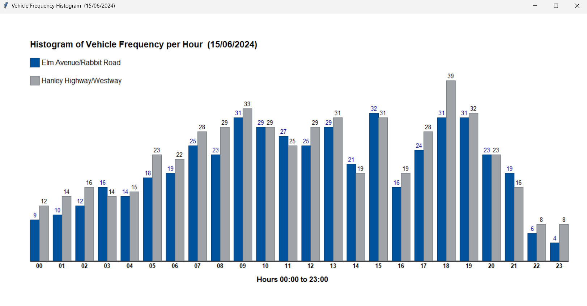

# 📊 Traffic Data Analyzer & Visualizer

This project is a **junior-level Python programe** that processes traffic CSV datasets, extracts ,meaningful statistics and visualizes vehicle flow through histograms using **Tkinter**.

---

## 📌 Features 
- **Input Validation**
    - Ensures valid date inputs (`DD/MM/YYYY`) within 2000-2024
    - Confirms continuation choice (`Y/N`)
- **Traffic Data Processing**
    - Reads CSV traffic datasets
    - Calculates metrics such as:
        - Total vehicles, trucks, electric vehicles, and two-wheeled vehciles
        - Vehicles over speed limits
        - Buses leaving Elm Avenue heading North
        - Scooters percentage at Elm Avenue
        - Rainy hours
        - Peak traffic hours at Hanley Highway
- **Visualization**
    - Generate Histograms of vehicle frequency per hour
    - Distinguishes Elm Avenue/Rabbit Raod vs Hanley Highway/Westway
- **Results Logging**
    - Saves outcomes in `results.txt`
    - Displays metrics in the console

---

## 📁 Project Structure

```bash
.
├── data/                     # CSV dataset directory
│   ├── traffic_data15062024.csv
│   ├── traffic_data16062024.csv
│   └── traffic_data21062024.csv
├── results.txt               # Processed outcomes
├── traffic_analysis.py       # Main Python script
├── Design.txt                # Program design (Pseudocode)
└── README.md                 # Project documentation

```

---

## 🚀 How to run

1. Clone this respository:
   
   ```bash
    git clone https://github.com/hasaRanger/Traffic Data Analyzer & Visualizer
    cd Traffic Data Analyzer & Visualizer
   ```
   
2. Make sure the csv files are inside the `data/` directory.
3. Run the main script:

   ```bash
      python Traffic Data Analyzer & Visualizer.py
   ```

4. Enter a valid date (`DDMMYYYY`) when prompted:
   - Example: `21062024`
  
6. View
   - Processed outcomes in the terminal
   - A histogram window showing hourly traffic flow
   - Saved results in `results.txt`
  
---

## 📃 Sample output

### cmd:
```console
Valid date entered 15/06/2024

data file selected is data/traffic_data15062024.csv
The total number of vehicles recorded for this date is 1037
The total number of trucks recorded for this date is 109
The total number of electric vehicles recorded for this date is 368
The total number of two-wheeled vehicles recorded for this date is 401
The total number of buses leaving Elm Avenue/Rabbit Road heading North is 15
The total number of Vehicles through both junctions without turning left or right is 363
The percentage of total vehicles recorded that are trucks for this date is 11%
The average number of bikes per hour for this date is 7
The total number of vehicles recorded as over the speed limit for this date is 205
The total number of vehicles recorded through Elm Avenue/Rabbit Road junction is 494
The total number of vehicles recorded through Hanley Highway/Westway junction is 543
11% of vehicles recorded through Elm Avenue/Rabbit Road are scooters
The highest number of vehicles in an hour on Hanley Highway/Westway is 39
The most vehicles through Hanley Highway/Westway were recorded between 18:00 - 19:00
The number of hours of rain for this date is 0

*************************************************************

Outcomes saved to the results.txt successfully.
Dataset for 15/06/2024 loaded successfully. Displaying Histogram.

Do you wish to load another dataset ('Y' for Yes or 'N' for No):
```

### Histogram:



---

## 🛠️ Tech Stack
- Python 3.12+
- Tkinter - for GUI & histogram visualization
- File I/O (CSV & TXT) - for dataset handling and result logging

---

## ✏️ Notes

- This is a **beginner-level** project completed as part of coursework during first semester/first year.
- This project can be extended with:
  - Dynamic CSV file discovery
  - Support for large datasets
  - More advanced analyzing & visulaizations (e.g., matplotlib)
  - Replace current CLI interface with a GUI, offering a better user experience


